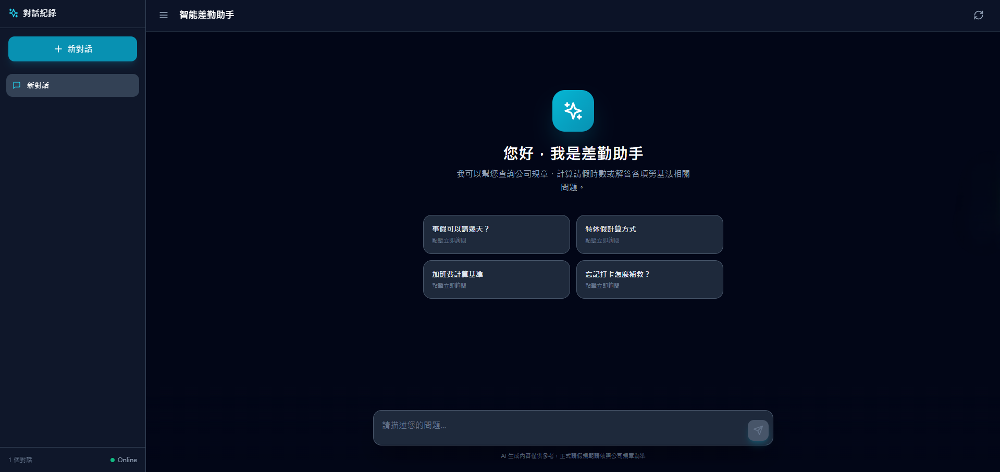

# 智能差勤問答系統 (Intelligent Leave & Attendance QA System)



這是一個基於 **LangGraph** 與 **RAG (Retrieval-Augmented Generation)** 技術的問答系統，專門設計用來回答即時的差勤與請假相關問題。系統結合了本地 LLM (Ollama) 與向量檢索，提供準確且具備上下文理解的回答。

## 🌟 特色 (Features)

- **RAG 架構**：結合向量資料庫 (FAISS) 與重排序 (Rerank) 機制，精準檢索規章制度。
- **LangGraph 工作流**：
  - **Query Rewriting**: 自動優化使用者問題。
  - **Retrieval & Reranking**: 多階段檢索以提升準確度。
  - **Tool Calling**: 支援工具調用 (例如：計算特休假薪資)。
- **現代化前端**：使用 React + TailwindCSS + Framer Motion 打造的流暢對話介面。
- **本地模型支援**：預設使用 `ministral-3:4b` 模型，保障資料隱私。

## 🛠️ 專案架構 (Project Architecture)

### Backend (`/backend`)
採用 FastAPI + LangChain/LangGraph 的模組化設計：

- `app.py`: FastAPI 應用程式入口與路由。
- `graph.py`: 定義 LangGraph 的節點 (Node) 與邊 (Edge) 邏輯。
- `rag_engine.py`: 封裝 RAG 核心元件 (VectorStore, Retriever, LLM Clients)。
- `tools.py`: 定義可供 LLM 調用的工具函數 (如 `calculate_vacation_pay`)。
- `config.py`: 集中管理設定與環境變數 (.env)。
- `models.py`: 定義 Pydantic 資料模型與 State。

### Frontend (`/frontend`)
採用 Vite + React 的元件化設計：

- `src/App.jsx`: 主應用程式邏輯與狀態管理。
- `src/components/`:
  - `ChatMessage.jsx`: 訊息顯示元件 (包含 RAG 思維鏈展示)。
  - `WelcomeSection.jsx`: 歡迎畫面與範例引導。
  - `LoadingBubble.jsx`: 等待動畫。

## 🚀 快速開始 (Quick Start)

### 前置需求 (Prerequisites)
- **Python** 3.11+
- **Node.js** 18+
- **Ollama**: 請先安裝並啟動 Ollama 服務。

### 1. 模型準備 (Model Setup)
本專案預設使用 `ministral-3:4b` 模型。請在終端機執行：

```bash
ollama pull ministral-3:4b
ollama run ministral-3:4b
```

### 2. 檔案準備 (File Setup)

1. 進入backend/data目錄，將你的檔案複製到該目錄，其中檔案需要三個欄位: 
   - question：問題
   - answer：答案
   - category：本題問題所屬之分類 (updata_csv_metadata 檔案生成)
   請注意:本範例屬請假差勤聊天用，若用途非本類型，請修改 prompt、updata_csv_metadata 至你需要的領域

### 3. 後端設定 (Backend Setup)

1. 進入後端目錄 (或是專案根目錄，視您的 Python 環境習慣而定)：
   ```bash
   # 安裝相依套件、也可使用uv
   pip install -r requirements.txt
   ```
   *(註：請確認已安裝 `fastapi`, `langgraph`, `langchain`, `pydantic-settings`, `uvicorn`, `faiss-cpu` 等套件)*
   
3. 設定環境變數：
   在專案根目錄建立 `.env` 檔案 (已提供範例)：
   ```env
   OLLAMA_BASE_URL=http://localhost:11434
   OLLAMA_MODEL=ministral-3:4b
   DATA_PATH=backend/data/your_file.csv
   ```

3. 啟動後端伺服器：
   ```bash
   # 在專案根目錄執行
   python -m backend.app
   ```
   伺服器將在 `http://localhost:8000` 啟動。

### 4. 前端設定 (Frontend Setup)

1. 進入前端目錄：
   ```bash
   cd frontend
   ```

2. 安裝相依套件並啟動開發伺服器：
   ```bash
   npm install
   npm run dev
   ```
   前端頁面將在 `http://localhost:5173` (或 Vite 分配的埠號) 啟動。

## 📖 使用說明 (Usage)

1. 開啟瀏覽器進入前端頁面。
2. 在輸入框輸入關於差勤的問題，例如：「特休假怎麼算？」或「事假可以請幾天？」。
3. 系統會顯示：
   - **回答**：AI 根據規章生成的回答。
   - **檢索思維鏈 (RAG Insights)**：點擊可展開查看 AI 如何重寫您的問題以及參考了哪些規章條文。

## 🤝 開發規範 (Development)
- 後端設定請修改 `.env` 與 `backend/config.py`。
- 新增工具請在 `backend/tools.py` 定義並註冊到 `backend/graph.py`。